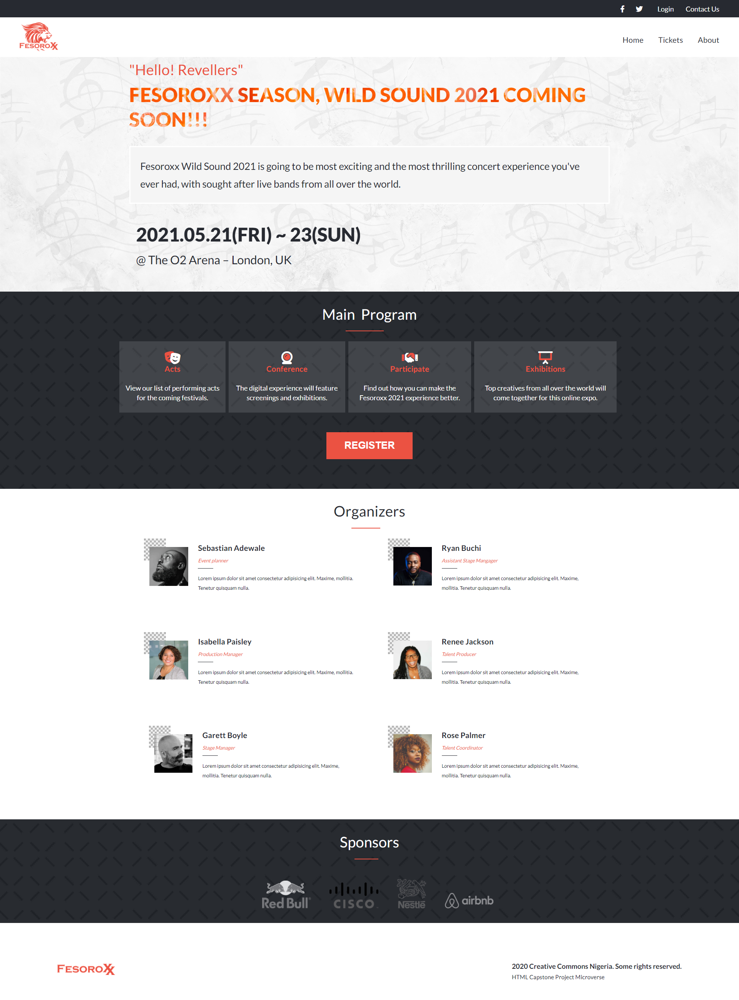

# FESOROXX (Html capstone project)

A Concert Webpage(s) for [Fesoroxx](https://ashakae.github.io/ferox-sonus/) designed with css, and Sass for code organization. This website has 3 pages with adaptive screen breakpoints to respond to various screen sizes, `mobile version up to 767px` and `desktop version from 768px upwards`

## Built With

- HTML
- CSS
- VS Code
- Git and Github
- Sass

## Author

👤 **Author1**

- GitHub: [@AshakaE](https://github.com/AshakaE)

## Live Demo

[Live Demo Link](https://ashakae.github.io/ferox-sonus/)

## 🤝 Contributing

Contributions, issues, and feature requests are welcome!

## Show your support

design inspired by [Cindy Shin](https://www.behance.net/gallery/29845175/CC-Global-Summit-2015)

## Acknowledgments

- stock images from [Pexels](https://www.pexels.com) and [Unsplash](https://unsplash.com)

- Hat tip to Microverse for their `README` template.

## 📝 License

This project is [MIT](https://opensource.org/licenses/MIT) licensed.

Copyright 2020 Ashaka Egerega 